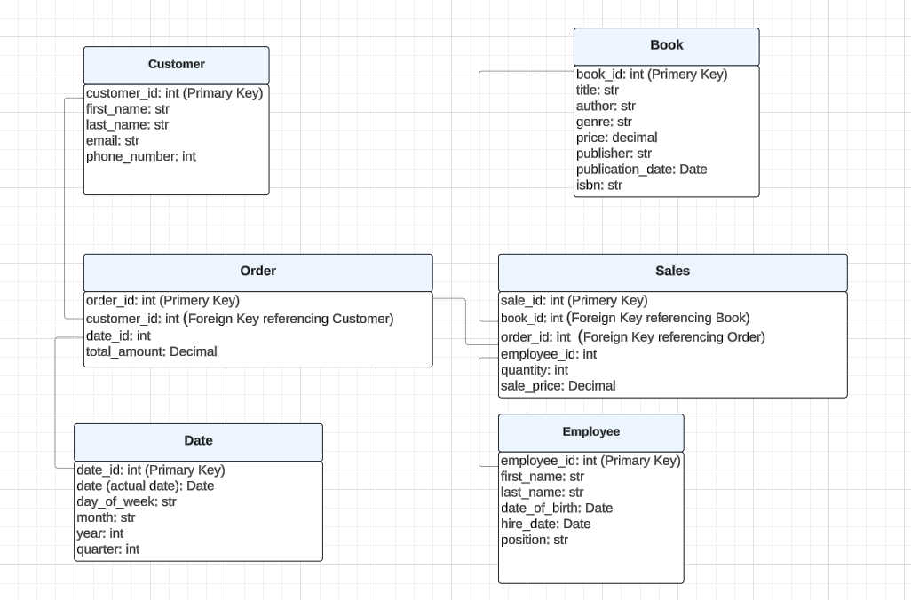
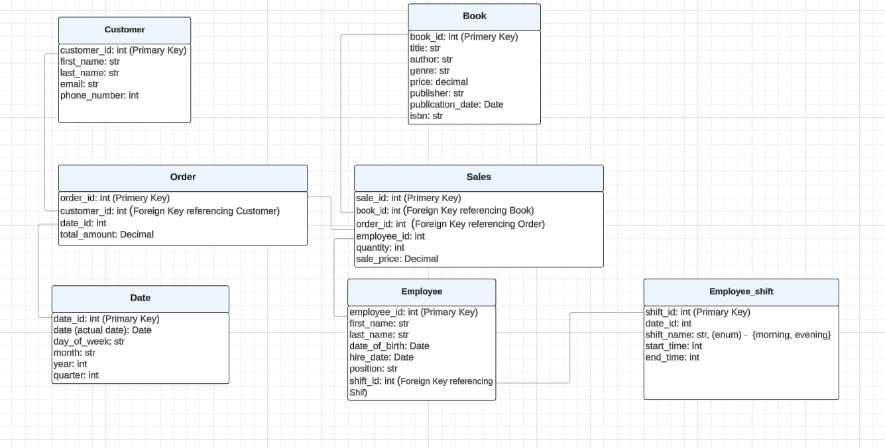

# Assignment 1: Design a Logical Model

## Question 1

Create a logical model for a small bookstore. 📚

At the minimum it should have employee, order, sales, customer, and book entities (tables). Determine sensible column and table design based on what you know about these concepts. Keep it simple, but work out sensible relationships to keep tables reasonably sized. Include a date table. There are several tools online you can use, I'd recommend [_Draw.io_](https://www.drawio.com/) or [_LucidChart_](https://www.lucidchart.com/pages/).



## Question 2

We want to create employee shifts, splitting up the day into morning and evening. Add this to the ERD.



## Question 3

The store wants to keep customer addresses. Propose two architectures for the CUSTOMER_ADDRESS table, one that will retain changes, and another that will overwrite. Which is type 1, which is type 2?

_Hint, search type 1 vs type 2 slowly changing dimensions._

Bonus: Are there privacy implications to this, why or why not?

```
Architecture 1: Overwrite Address (Type 1 Slowly Changing Dimension)
In this architecture, any update to the customer address overwrites the existing data. This is simple but does not keep a history of address changes.

CREATE TABLE Customer (
    customer_id INT PRIMARY KEY,
    first_name VARCHAR(50),
    last_name VARCHAR(50),
    email VARCHAR(100),
    phone_number VARCHAR(15)
);

CREATE TABLE Customer_Address (
    customer_id INT PRIMARY KEY,
    address_line1 VARCHAR(100),
    address_line2 VARCHAR(100),
    city VARCHAR(50),
    state VARCHAR(50),
    zip_code VARCHAR(10),
    country VARCHAR(50),
    FOREIGN KEY (customer_id) REFERENCES Customer(customer_id)
);

Pros:

Simpler design.
Less storage space required.
Easier to implement and query.

Cons:
No historical data retention.
Cannot track changes in addresses over time.

Architecture 2: Retain Address History (Type 2 Slowly Changing Dimension)
In this architecture,  maintain historical addresses by adding start_date and end_date fields to track when each address is valid.
New addresses are adde as new rows with updated date ranges.

CREATE TABLE Customer (
    customer_id INT PRIMARY KEY,
    first_name VARCHAR(50),
    last_name VARCHAR(50),
    email VARCHAR(100),
    phone_number VARCHAR(15)
);

CREATE TABLE Customer_Address (
    customer_address_id INT PRIMARY KEY,
    customer_id INT,
    address_line1 VARCHAR(100),
    address_line2 VARCHAR(100),
    city VARCHAR(50),
    state VARCHAR(50),
    zip_code VARCHAR(10),
    country VARCHAR(50),
    start_date DATE,
    end_date DATE,
    FOREIGN KEY (customer_id) REFERENCES Customer(customer_id)
);

Pros:
Full historical data retention.
Ability to track changes in addresses over time.
Useful for auditing and understanding customer behavior.

Cons:
More complex design.
Increased storage space required.
More complex queries to retrieve current and historical data.

Privacy Implications
Type 1 (Overwrite Address):

Privacy Concerns: Minimal. Since only the current address is stored, there is less historical data to manage and protect.
Data Protection: Standard protection measures such as encryption and access controls should be sufficient.

Type 2 (Retain Address History):

Privacy Concerns: Higher. Storing historical addresses could raise privacy concerns as it keeps a record of where a customer has lived over time, which might be sensitive information.
Data Protection: Enhanced protection measures are necessary, including encryption, strict access controls, and regular audits to ensure compliance with data protection regulations such as GDPR or CCPA.

In both architectures, it is crucial to implement robust data protection measures to safeguard customer information. This includes using encryption for sensitive data, implementing strict access controls, and ensuring regular audits and compliance with relevant data protection regulations.


```

## Question 4

Review the AdventureWorks Schema [here](https://i.stack.imgur.com/LMu4W.gif)

Highlight at least two differences between it and your ERD. Would you change anything in yours?

```
Differences:

1. Schema Segmentation - AdventureWorks is divided into different schemas, which provides a clear separation of concerns and improves manageability and security. Bookstore Model: The bookstore model uses a single schema, which is simpler but might become cumbersome as the database grows.

2. Granularity and Normalization Level:
AdventureWorks: The AdventureWorks schema is highly normalized with numerous tables detailing specific aspects of business processes.
This allows for detailed data integrity and reduced redundancy.

Bookstore Model: The proposed bookstore model is simpler with fewer tables, focusing on core entities like Customer, Book, Order, and Sales. This might not capture all granular details but is easier to manage.


```

# Criteria

[Assignment Rubric](./assignment_rubric.md)

# Submission Information

🚨 **Please review our [Assignment Submission Guide](https://github.com/UofT-DSI/onboarding/blob/main/onboarding_documents/submissions.md)** 🚨 for detailed instructions on how to format, branch, and submit your work. Following these guidelines is crucial for your submissions to be evaluated correctly.

### Submission Parameters:

- Submission Due Date: `June 1, 2024`
- The branch name for your repo should be: `model-design`
- What to submit for this assignment:
  - This markdown (design_a_logical_model.md) should be populated.
  - Two Entity-Relationship Diagrams (preferably in a pdf, jpeg, png format).
- What the pull request link should look like for this assignment: `https://github.com/<your_github_username>/sql/pull/<pr_id>`
  - Open a private window in your browser. Copy and paste the link to your pull request into the address bar. Make sure you can see your pull request properly. This helps the technical facilitator and learning support staff review your submission easily.

Checklist:

- [ ] Create a branch called `model-design`.
- [ ] Ensure that the repository is public.
- [ ] Review [the PR description guidelines](https://github.com/UofT-DSI/onboarding/blob/main/onboarding_documents/submissions.md#guidelines-for-pull-request-descriptions) and adhere to them.
- [ ] Verify that the link is accessible in a private browser window.

If you encounter any difficulties or have questions, please don't hesitate to reach out to our team via our Slack at `#cohort-3-help`. Our Technical Facilitators and Learning Support staff are here to help you navigate any challenges.
